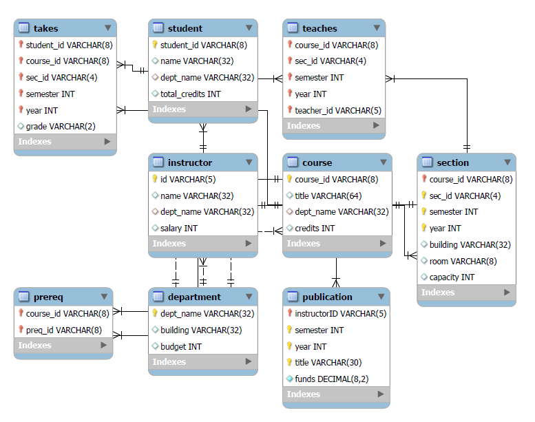

# UnivDB
Project 2: DB-backed Web Application: University Management System

This is the final project for EE468  Database Systems taught by Prof. Hou at Clarkson University

This project takes our knowledge of SQL that we have been learning out the semester
and puts it into practice for a fully functional and practical user interface
to interact with the data.

## Authors
Colin Gasiewicz : 
F1, F2, F3, Views,Table Templates, readme

Ryan Quirk: 
F5, All CSS, Views, HTML, and Table Templates

John Parker: 
F4, F6, Documentation

## Database Design
database table schema is in `init.sql`

EER Diagram

## How to start
1. Create file `file.txt` in directory `UnivDB/univSite` in this file 
include your root password for MySQL
2. Run init.sql with root privilege to initialise the database and load the testing data
3. Run `./start.bat` to start server
